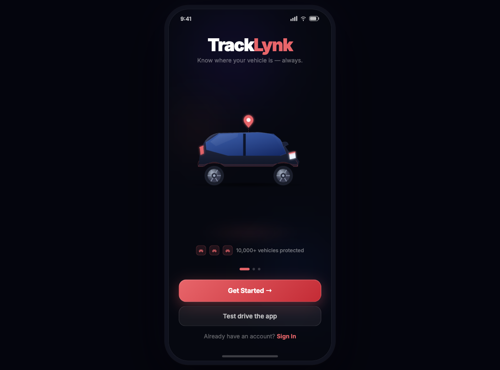
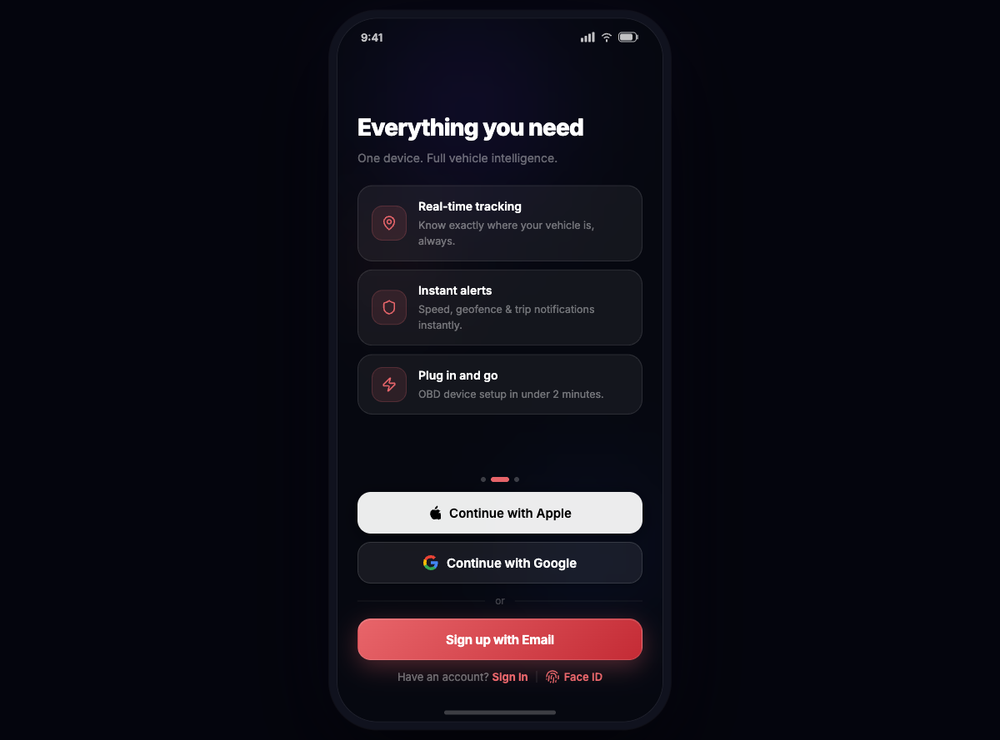
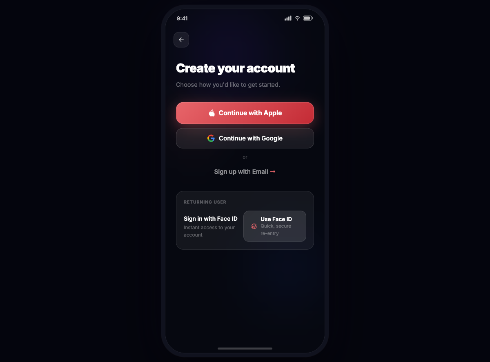
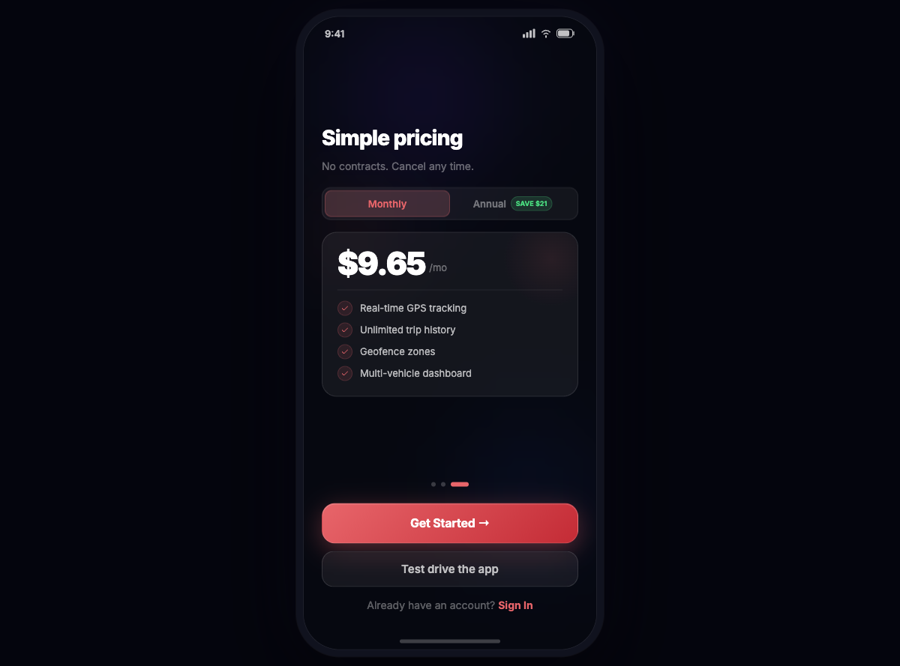
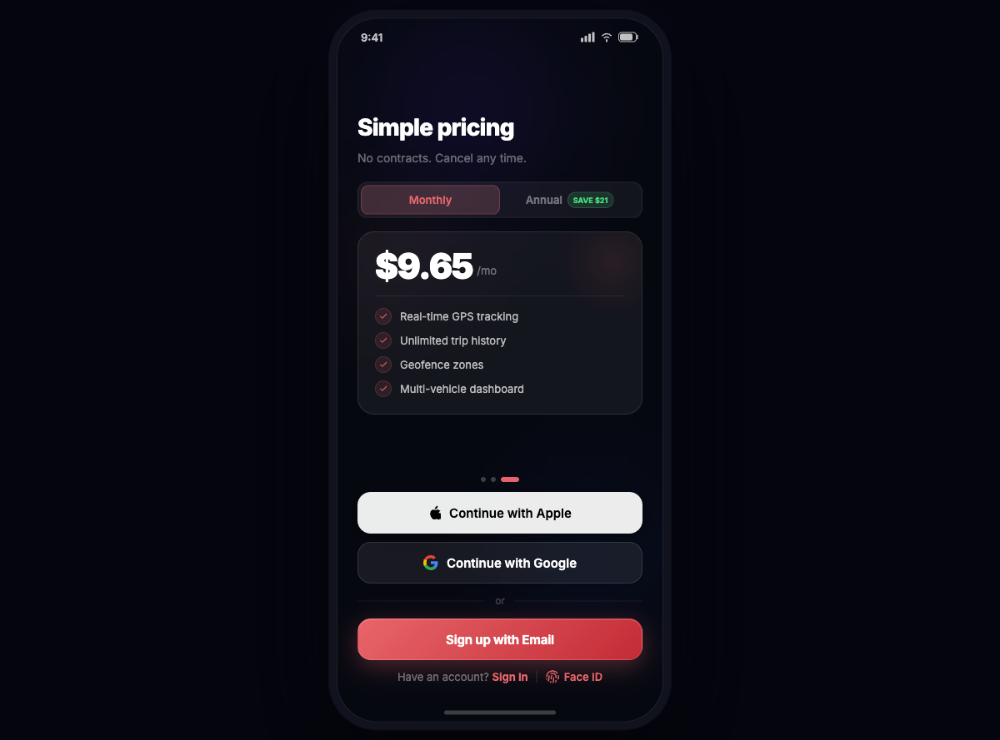
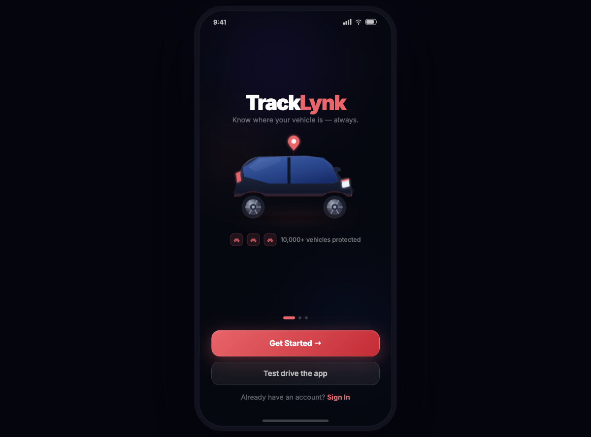

# TrackLynk Lite — Onboarding Prototype

A high-fidelity mobile onboarding prototype for **TrackLynk**, a GPS vehicle tracking app. Built in React with Framer Motion, rendered inside a pixel-accurate iPhone frame at 390×844 px.



---

## Table of Contents

- [Overview](#overview)
- [Live Demo](#live-demo)
- [Screenshots](#screenshots)
- [Tech Stack](#tech-stack)
- [Project Structure](#project-structure)
- [Screen Flow](#screen-flow)
- [Design System](#design-system)
- [Animation Architecture](#animation-architecture)
- [Getting Started](#getting-started)
- [Research & UX Assets](#research--ux-assets)
- [Known Issues & Next Steps](#known-issues--next-steps)

---

## Overview

TrackLynk Lite is a prototype designed to validate the end-to-end onboarding experience for a consumer GPS vehicle tracking product. It covers:

- **Welcome carousel** — hero, feature highlights, and pricing, with auto-advance and drag-to-swipe
- **OAuth + biometric auth** — Apple, Google, email, and Face ID flows
- **Account creation** — email/password sign-up form with live validation
- **Vehicle setup** — VIN barcode scan (simulated) with manual fallback
- **OBD device pairing** — animated device scan UI
- **Subscription plan selection** — monthly/annual toggle with animated price transition
- **Success screen** — animated confirmation with next-steps checklist

The prototype was built to inform native iOS/Android development and user-testing sessions, not for production deployment.

---

## Live Demo

Clone the repo and run locally (see [Getting Started](#getting-started)). No hosted deployment yet.

---

## Screenshots

| Welcome | Auth | Sign Up |
|:---:|:---:|:---:|
|  |  |  |

| Features | Pricing | Vehicle |
|:---:|:---:|:---:|
|  |  |  |

---

## Tech Stack

| Layer | Technology |
|---|---|
| UI Framework | React 18.3.1 |
| Build Tool | Vite 5.3.1 |
| Animation | Framer Motion 11.0.0 |
| Icons | Lucide React 0.383.0 |
| Styling | Tailwind CSS 3.4.4 + inline style objects |
| CSS Processing | PostCSS 8.4.38 + Autoprefixer |
| Font | Inter (Google Fonts — 400/500/600/700/800/900) |
| Package Manager | npm |

---

## Project Structure

```
Tracklynk-lite/
│
├── onboarding-prototype/          # Main React application
│   ├── src/
│   │   ├── App.jsx                # Navigation shell + phone frame
│   │   ├── main.jsx               # React entry point
│   │   ├── index.css              # Global styles, animations, glassmorphism utilities
│   │   │
│   │   ├── screens/               # One file per onboarding step
│   │   │   ├── Welcome.jsx        # Step 0 — 3-slide carousel (hero, features, pricing)
│   │   │   ├── Auth.jsx           # Step 1 — OAuth + Face ID
│   │   │   ├── SignUp.jsx         # Step 2 — Email/password form + shared style exports
│   │   │   ├── AddVehicle.jsx     # Step 3 — VIN barcode scan / manual entry
│   │   │   ├── VehicleDetails.jsx # Step 4 — Nickname + license plate
│   │   │   ├── ScanDevice.jsx     # Step 5 — OBD device pairing
│   │   │   ├── ChoosePlan.jsx     # Step 6 — Subscription plan
│   │   │   ├── Success.jsx        # Step 7 — Completion + next-steps
│   │   │   └── ProgressBar.jsx    # Shared: step indicator + back button
│   │   │
│   │   └── components/
│   │       └── Car3D.jsx          # 3D car PNG with GPS pin overlay + ground glow
│   │
│   ├── dist/                      # Vite production build output
│   ├── index.html                 # HTML template
│   ├── vite.config.js
│   ├── tailwind.config.js
│   └── package.json
│
├── deep-dive/                     # Architecture documentation
│   └── tracklynk-onboarding-prototype-2026-04-16.md
│
├── qa-reports/                    # QA audit reports
│   ├── welcome-audit-2026-04-16-2131.md
│   └── ...
│
├── Car_images/                    # 3D vehicle render assets
│
├── Boucie screenshots/            # Competitor UX research (Bouncie)
│
└── Research assets
    ├── OBD_Feature_Matrix.html
    ├── OBD_UIX_Research.html
    ├── TracklynkLite_Competitive_Analysis.pptx
    ├── Bouncie_UX_Audit.pptx
    ├── Bouncie_UX_Gap_Analysis.pptx
    └── vehicle-ui-moodboard.html
```

---

## Screen Flow

```
Welcome (carousel)
  └─► Auth (OAuth / Face ID)
        └─► SignUp (email + password form)
              └─► AddVehicle (VIN scan / manual)
                    └─► VehicleDetails (nickname, plate)
                          └─► ScanDevice (OBD pairing)
                                └─► ChoosePlan (subscription)
                                      └─► Success
                                            └─► [loops to Welcome via goTo(0)]
```

### Navigation mechanics

- `next()` — advances one step forward (direction = +1)
- `back()` — steps backward (direction = −1)
- `goTo(i)` — jumps to any step; sets direction based on delta
- All transitions are directional slide animations via Framer Motion `AnimatePresence`

The "Test drive the app" shortcut on the Welcome screen jumps directly to step 5 (ScanDevice) to demonstrate the device-pairing flow without going through account creation.

---

## Design System

### Colors

| Token | Value | Usage |
|---|---|---|
| Brand red | `#E8656A` | Primary buttons, icons, accents |
| Brand red dark | `#C42B35` | Button gradient endpoint |
| Success green | `#4ade80` | Validation states, device confirmed |
| Background | `#04050d` / `#060810` | App + phone backgrounds |
| Glass surface | `rgba(255,255,255,0.055)` | Cards, inputs, overlays |
| Text primary | `#ffffff` | Headings, values |
| Text secondary | `rgba(255,255,255,0.38–0.42)` | Subtitles, descriptions |
| Text muted | `rgba(255,255,255,0.22–0.28)` | Legal text, hints |

### Typography

All text uses **Inter**. Common scales:

| Role | Size | Weight |
|---|---|---|
| Wordmark | 42px | 900 |
| Screen heading | 26–30px | 800–900 |
| Section heading | 28px | 800 |
| Body / label | 14–15px | 400–600 |
| Caption / legal | 11–12.5px | 400–600 |
| Input | 15px | 400 (empty) / 600 (filled) |

### Glassmorphism

Cards and inputs use a consistent glass language:

```css
background: rgba(255,255,255,0.055);
backdrop-filter: blur(20px);
border: 1px solid rgba(255,255,255,0.10);
```

The `.glass` and `.glass-sm` utility classes in `index.css` encode these. The `glassCard` JS object in `SignUp.jsx` is used inline across screens.

### Phone Frame

The prototype renders inside a `390×844 px` frame (iPhone 12 mini dimensions) with:
- `border-radius: 48px`
- Multi-layer `box-shadow` for depth and glow
- Fixed iOS-style status bar (time: 9:41, signal, WiFi, battery SVGs)
- Home indicator bar at the bottom

---

## Animation Architecture

### Screen transitions (App.jsx)

```js
const slideVariants = {
  enter: (dir) => ({ x: dir > 0 ? '100%' : '-100%', opacity: 0 }),
  center: { x: 0, opacity: 1 },
  exit:  (dir) => ({ x: dir > 0 ? '-100%' : '100%', opacity: 0 }),
}
// Spring: stiffness 380, damping 38, mass 0.8
```

`AnimatePresence mode="popLayout"` prevents overlapping screens during fast taps.

### Welcome carousel

The 3-slide carousel auto-advances every 4.5 s with `setInterval`. Manual drag (`dragElastic: 0.12`) or dot-tap resets the timer via `startTimer()`. Each slide re-animates its content independently on mount.

### Key micro-interactions

| Interaction | Implementation |
|---|---|
| Button press | `whileTap={{ scale: 0.97 }}` |
| Face ID scanning | State machine: idle → scanning (blinking icon) → verified (check) → idle |
| OBD scan line | `animate={{ top: ['18%', '78%', '18%'] }}` repeating loop |
| Status LED | Opacity pulse animation, color switches on `scanned` |
| VIN validation | Border + shadow transition on `vin.length === 17` |
| Success checkmark | `pathLength` draw animation on SVG `<path>` |
| Progress bar | Spring-animated `width` between step percentages |
| Pricing toggle | Spring-animated sliding indicator div |
| Feature list | Stagger variant: 90 ms delay between list items |
| Car float | CSS `@keyframes float` — 8 px translateY over 4 s |

### Spring config reference

| Use | Stiffness | Damping | Mass |
|---|---|---|---|
| Screen slides | 380 | 38 | 0.8 |
| Feature stagger items | 360 | 28 | — |
| Pricing toggle | 400 | 30 | — |
| Success badge | 400 | 18 | — |
| Progress bar | 300 | 32 | — |

---

## Getting Started

### Prerequisites

- Node.js 18+
- npm 9+

### Install & run

```bash
cd onboarding-prototype
npm install
npm run dev
```

Open [http://localhost:5173](http://localhost:5173). The prototype renders centered in the browser at any viewport size.

### Build

```bash
npm run build
# Output: onboarding-prototype/dist/
```

### Preview production build

```bash
npm run preview
```

---

## Research & UX Assets

All research materials live at the repo root:

| File | Description |
|---|---|
| `OBD_Feature_Matrix.html` | Comparison of OBD device features across competitors |
| `OBD_UIX_Research.html` | UX research findings for OBD setup flows |
| `vehicle-ui-moodboard.html` | Visual moodboard for vehicle UI patterns |
| `TracklynkLite_Competitive_Analysis.pptx` | Full competitive landscape analysis |
| `Bouncie_UX_Audit.pptx` | Detailed UX audit of Bouncie (primary competitor) |
| `Bouncie_UX_Gap_Analysis.pptx` | Gap analysis — Bouncie vs TrackLynk opportunity areas |
| `Boucie screenshots/` | 15+ annotated screenshots of the Bouncie app |
| `deep-dive/` | In-depth prototype architecture documentation |
| `qa-reports/` | QA audit reports per screen |

---

## Known Issues & Next Steps

### Active issues

- `setTimeout` calls in `FaceIDButton` (`Auth.jsx`) and `ScanDevice.jsx` are not cleaned up on unmount. If the user navigates away mid-animation, the callback fires on an unmounted component and advances the step unexpectedly.
- The "Sign In" button routes to the sign-up flow (`next()`) — sign-in is not yet implemented.
- Shared style exports (`screenBase`, `glassCard`, `PrimaryButton`, etc.) live in `SignUp.jsx`. This should be refactored into a dedicated `src/ui/` module before scaling the codebase.
- `goTo(5)` on the "Test drive" button is a hardcoded index — fragile if screen order changes.

### Planned work

- [ ] Extract shared styles/components out of `SignUp.jsx` into `src/ui/index.js`
- [ ] Clean up `setTimeout` calls with `useEffect` + `clearTimeout`
- [ ] Implement a real sign-in screen
- [ ] Add `aria-label` to all icon-only buttons (back button, password toggle)
- [ ] Add focus management between screen transitions
- [ ] Replace hardcoded `goTo(5)` with `goTo(SCREENS.indexOf('scan'))`
- [ ] Implement multi-vehicle support in the vehicle selection step
- [ ] Connect plan selection to Stripe or RevenueCat (for native handoff)

---

## License

This is a private prototype. All design assets, research materials, and code are proprietary to the TrackLynk project.
